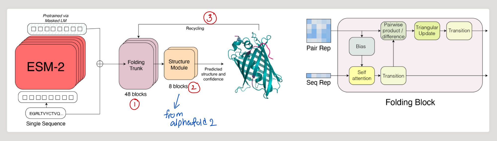
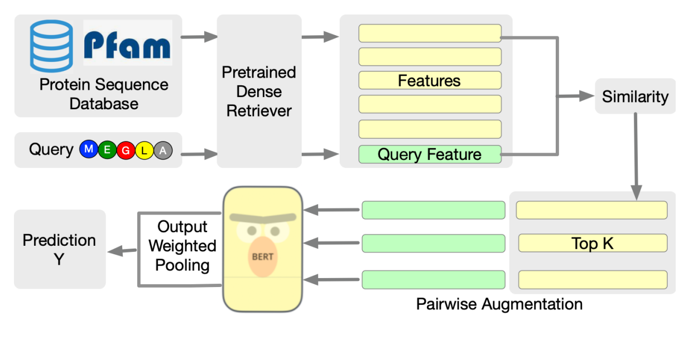
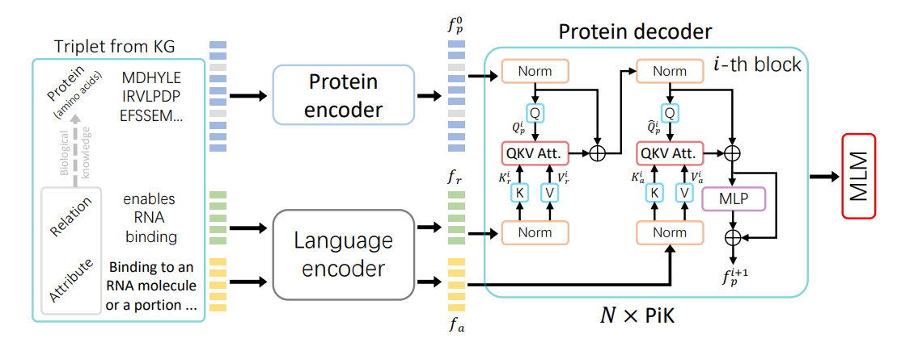
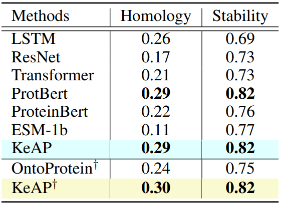
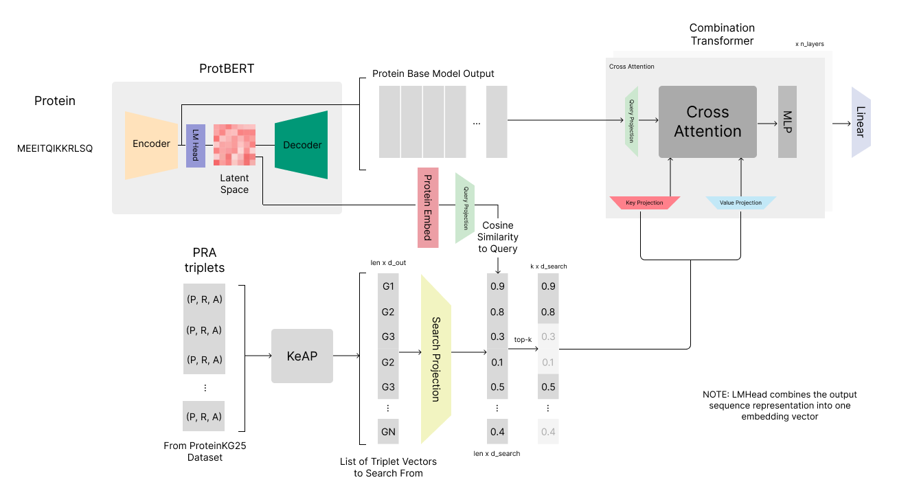

# KeAP-RSA Model

This proposal includes the details for a protein representation model architecture inspired by the success of KeAP and RSA Transformer. It involves retrieving multiple triplets from the ProteinKG25 dataset to provide relevant structural and functional information.

So far, I have implemented this model in PyTorch and PyTorch-Lightning code and tested its functionality. I have also trained the model in preliminary settings to see if the training loop is functioning properly. However, I have not trained my model fully, mainly due to time and compute constraints. Within the next few days, I hope to start the initial training of the model and setting up downstream tasks to evaluate on.

I am reaching out to researchers to help mentor me on this project from a biological perspective. While I have been reading AI literature for 3-4 years now, I want to get a biological and mathematical perspective on my model to mathematically prove its abilities and plan future augmentations/changes to the model to improve performance.

## 1. Introduction
Protein representation learning is a key task in today's medical landscape, and it can be used to architect new proteins for research and drug discovery purposes. Many lines of research have been pursued in the field of protein representation learning. Most of these methods revolve around representing a protein as a sequence and passing this embedded sequence information into a transformer. Models such as [ProtBERT](https://academic.oup.com/bioinformatics/article/38/8/2102/6502274) and [ESM2](https://www.biorxiv.org/content/10.1101/2022.12.21.521521v1) are effective models in this category.

<em>Figure 1: A diagram of the popular ESMfold architecture, which uses the ESM2 protein model as a backbone for the structure prediction downstream tasks. The diagram depicts the inputs and outputs of the ESM2 model</em>

After the use of transformers for protein modeling was introduced, augmentations to the original model were made to improve ability to inherently comprehend protein structures and functions, as well as how different proteins relate to each other. Two prominent methods include leveraging multiple sequence alignments (MSAs) or leveraging knowledge graph information.

### 1.1 MSA-based Methods

A multiple sequence alignment consists of modifying a set of amino acids $S_A$ such that each sequence's length conforms to at least a specific length $L$. MSA-aligned sequences can be compared across similar positions to identify homologous structures in biological sequences. The [MSA transformer](https://proceedings.mlr.press/v139/rao21a.html) architecture uses a database of MSA sequences and processes them in a transformer using axial attention. Axial attention allows to compute relationships along the current sequence as well as along the same position in the MSA alignment. This provides information about relevant homologous structures and improved performance in stability and homology tasks.

A further development of this method involved using direct memory retrieval. The [RSA transformer](https://arxiv.org/abs/2302.12563) proved that alignment is not needed to provide relevant structure and homology information from similar sequences. Instead of using an MSA alignment, the RSA transformer architecture retrieves $k$ number of embedded sequence representations from the **Pfam** database. It then includes these retrieved protein sequences within the computation of the original target sequence to provide a more informed output.

<em>Figure 2: A diagram of the RSA transformer, which retrieves relevant protein sequences from the Pfam database and parses them in parallel using ProtBERT. The outputs are pooled to create a robust protein representation</em>

RSA transformer has shown great results in structure-based protein tasks, such as stability and homology. However, function-based tasks, including protein-protein interaction and protein semantic embedding evaluation, did not show as striking performance. This might have occurred due to the lack of functional information that can be derived from raw sequences. 

### 1.2 Knowledge Graph-based Methods

As an alternative to similar-sequence based protein modeling methods, knowledge graphs were leveraged to provide functional information to protein representation models. These models leveraged the Gene Ontology graph. This graph was augmented with protein relations in the [ProteinKG25](https://www.zjukg.org/project/ProteinKG25/) dataset. The ProteinKG25 dataset is a graph of protein sequences and functional information in text format. The [OntoProtein](https://arxiv.org/abs/2201.11147) model combines these representations using knowledge graph embedding and achieved state-of-the-art results on protein function-based tasks.

The [KeAP](https://openreview.net/forum?id=VbCMhg7MRmj) model improved on OntoProtein by combining the a triplet representation of a protein, relation, and attribute (a function or component) into one transformer model using cross attention. In this model, relations and attribute embeddings were computed using a foundation medical model, while protein model representations were computed using ProtBERT. This cross attention method showed state-of-the-art results and improved upon OntoProtein's methodologies.

<em>Figure 3: A diagram of the KeAP model. This model embeds proteins using ProtBERT and relations and attribute text from the ProteinKG25 dataset using a medical-finetuned LM. These representations are combined using cross attention in the protein decoder model.</em>

While the KeAP model achieved state-of-the-art results in functional tasks that require global context (e.g. protein-protein interaction and protein semantic similarity), it did not make any improvements on its base model when it came to structural tasks, such as stability, homology, and binding affinity. 

  

<em>Table 1: A results table from the KeAP paper. KeAP uses ProtBERT as a backbone for its predictions. This results table shows that KeAP provided no improvement over its backbone model despite its integration of relational and attribute information. This shows that it does not provide an advantage in structural tasks</em>

In addition, the KeAP model is bound to the ProteinKG25 knowledge graph, and is unable to predict information without a relevant attribute/function to compare it to. Data seen in the ProteinKG25 dataset is difficult to create for on-demand tasks such as drug discovery, which makes this model difficult to use in production.

The comparison between these two types of models shows that one method provides relevant structural information, while the other provides cohesive functional information. This model proposes to combine these methods to create robust protein representations. In addition, the proposed model will be free of KeAP's constraints to its knowledge graph

## 2. Methods

This method improves on the KeAP architecture to provide more robust functional information and relevant structural information. This is done by integrating a protein transformer with a vector search across protein-relation-attribute triplets generated by the KeAP architecture. KeAP's output embeddings provide structural information from proteins as well as relevant functional information. By searching this database of embeddings generated from the ProteinKG25 dataset, the new model architecture will be able to leverage both protein structural information and functional information from the description of relations and attributes

While the KeAP model is only trained on one triplet in the protein knowledge graph, this method can allow the parsing of multiple relation and attribute triplets, and include protein sequences that share similar functions/attributes.

<em>Figure 4: A diagram of the proposed architecture. This architecture first embeds a protein using a base model (ProtBERT is used). The output from that is then projected into a query vector, which is used to retrieve relevant structure-function triplets from the ProteinKG25 database (embeddings created by KeAP). These representations are then combined in the final transformer layers using cross attention</em>

This model only takes a protein as the input, and does not require a full triplet to run a protein prediction. The protein $x_p$ is first processed using a backbone model, such as ProtBERT. This generates the hidden states $h_p$, which are then combined through elementwise addition, a linear layer, and a tanh activation function to create a semantic representation $y_p$

$$h_p = BERT(x_p)$$
$$y_p = tanh(W_y \cdot add(h_p))$$

The output $y_p$ is then used in a similarity search across the (protein, relation, attribute) embedding database, and the top-k results are selected.

$$Q_{search} = W_sy_p$$
$$att = \dfrac{Q \cdot W_S(O_{keap})}{||Q||\cdot||W_S(O_{keap})||}$$
$$x_{keap} = topk(x, att)$$

After the top-k matching triplets are selected, the triplet and protein embeddings are passed through a cross-attention transformer encoder

$$Q = W_Qh_p, K = W_Kx_{keap}, V = W_Vx_{keap}$$
$$U_{att} = softmax(\dfrac{Q \cdot K^T}{\sqrt{d_{model}}})V$$
$$U = Norm(W_O(U_{att})) + h_p$$
$$O = Norm(MLP(U)) + U$$

The output of the cross attention encoder process creates the output for the model. This model combines techniques from RSA transformer and KeAP to provide both structural and functional similarity information to improve protein representations.

## Concerns/Improvements To Test

- The ProteinKG25 database is restricted to only 400,000 proteins. The space has to be augmented to include a more robust vector database to retrieve from for the model. However, this extension can be done at any time if proper triplets are used with the KeAP model.
- Compute constraints with this model are difficult. While the KeAP-embed processing can be done in advance, loading a large number of triplets into memory to find relevant information, running the combination transformer, and running the ProtBERT backbone model requires a lot of compute power. While I'm planning to train this model with a smaller version of ProtBERT and combination transformer, I hope to extend this model with more compute in the future.

